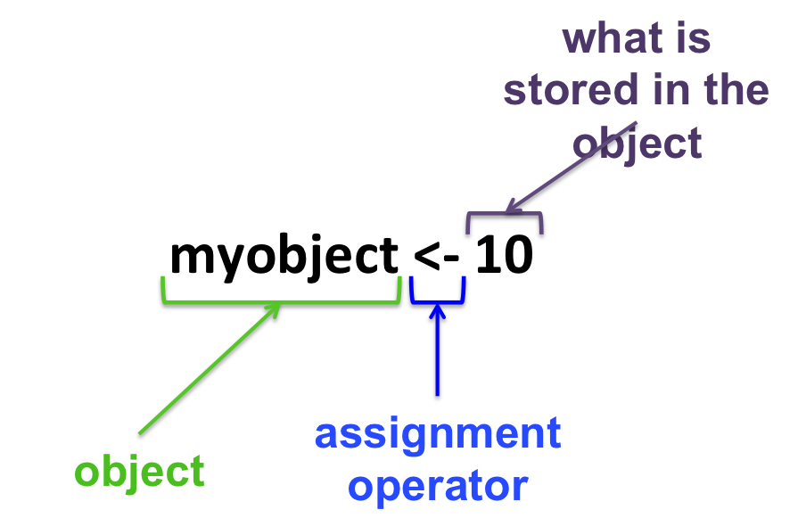

# R basics

<h3>Arithmetic operators</h3>

| Operator  | Function      |
|:--------: |:-------------:|
|     +     | addition      |
|     -     | subtraction   |
|     /     | division      |
|     *     | multiplication|
|  ^ or **  | exponential   |

In the R terminal:
```{r}
10 - 2
```
Type **Enter** for R to interpret the command.

<h3>Simple calculations</h3>

Given the following table:

| type of RNA | Total   |
| :---------: |:-------:|
| mRNA        | 329     |
| miRNA       | 45      |
| snoRNA      | 12      |
| lncRNA      | 28      |


Calculate the total number of RNAs reported in the table:
```{r}
329 + 45 + 12 + 28
```
What is the percentage of miRNA?
```{r}
( 45 / 414 ) * 100
```

<h2>Objects in R</h2>

Everything that stores any kind of data in R is an **object**:


<h2>R syntax</h2>


<h3>Assignment operators</h3>
+ **<-** or **=**
+ Essentially the same but, to avoid confusions:
  + Use **<-** for assignments
  + Keep **=** for functions arguments

<h3>Assigning data to an object</h3>

* Assigning a value to the object **B**:
```{r}
B <- 10
```

* Reassigning: modifying the content of an object:
```{r}
B + 10
```

<span style="color:red">**B unchanged !!**</span><br>
```{r}
B <- B + 10
```

<span style="color:red">**B changed !!**</span><br>

* You can see the objects you created in the upper right panel in RStudio: the environment.

 > Go to [Functions in R](https://sbcrg.github.io/CRG_RIntroduction/functionsbasics)
<br>
> [back to home page](https://sbcrg.github.io/CRG_RIntroduction)

