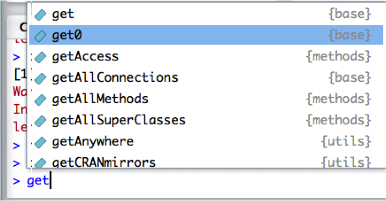

<h2>R scripts</h2>

<h3>Create and save a script</h3>
* Store commands in a .R/.r script. Create in RStudio with: 
  + File -> New File -> R Script
  + Once the file has opened: File -> Save 
  + Specify a name: ***the extension .R is automatically added***
  

* Execute commands or blocks of commands from RStudio:


<h3>R syntax</h3>

* Case sensitive
* Comment lines start with **#**
* Commands are separated by a **new line** or **;**
```{r}
# This is a comment: it will not be interpreted
a <- 10
A + 1
# Will throw an error because A and a are different
```


<h3>RStudio tips in the console</h3>

 Upper arrow: goes to the commands previously typed.

Ctrl + cmd +  : Browse command history.

 Type a letter in the console + "tab": R Studio proposes the different functions or object stored which start with that letter. e.g. get + "tab":



<br>
Time for [Exercise 1](https://sbcrg.github.io/CRG_RIntroduction/exercise1): Getting started!
<br>
> [back to home page](https://sbcrg.github.io/CRG_RIntroduction)

