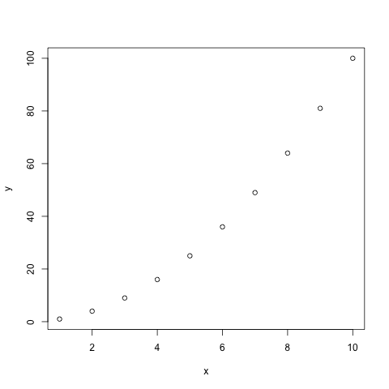
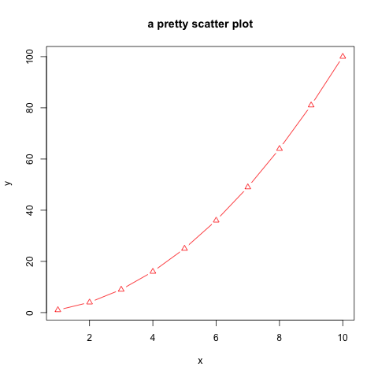
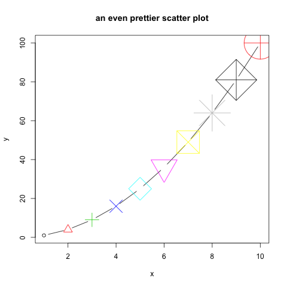
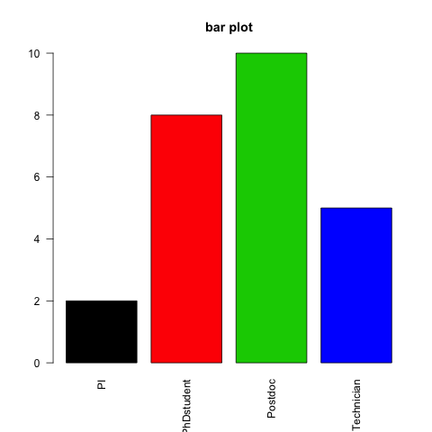
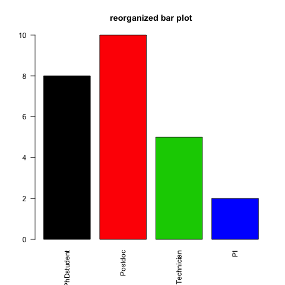
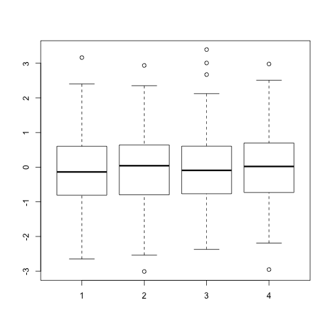
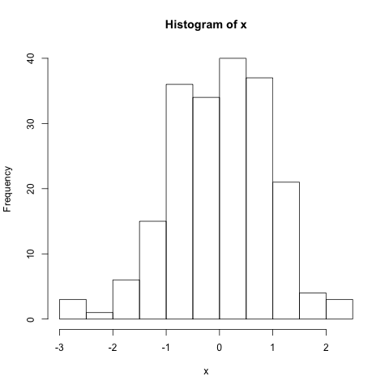
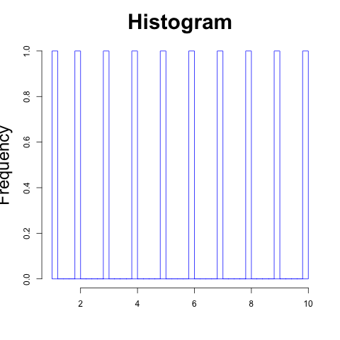

<h2>Basic plots in R</h2>

R-base package graphics offers functions for producing many plots, for example:

* scatter plots - plot()
* bar plots - barplot()
* pie charts - pie()
* box plots - boxplot()
* histograms - hist()

<h3>Scatter plots</h3>

*A scatter plot has points that show the **relationship** between two sets of data.*

* Simple scatter plot

```{r}
# Create 2 vectors
x <- 1:10
y <- x^2

# Plot x against y
plot(x, y)
```


* Add parameters: color, point type, title

```{r}
# col: color
# pch: type of point
# type: "l" for line, "p" for point, "b" for both point and line
# main: title of the plot
plot(x, y, 
	col="red", 
	pch=2, 
	type="b", 
	main="a pretty scatter plot")
```


* You can play a bit:

```{r}
plot(x, y, 
	col=1:10, 
	pch=1:10, 
	cex=1:10, 
	type="b", 
	main="an even prettier scatter plot")
```


<h4>Different type of points that you can use:</h4>


<h4>About</h4>

* Codes 1 to 8 are shortcuts for "black", "red", "green", "blue", "cyan", "magenta", "yellow", "grey".

* There is a larger set of build-in colors that you can use:
```{r}
# see all 657 possible build-in colors:
colors()

# looking for blue only? You are down to 66 options:
grep("blue", colors(), value=TRUE)
``` 
You can also find them [here](http://www.stat.columbia.edu/~tzheng/files/Rcolor.pdf).

<h3>Bar plots</h3>

*A bar chart or bar plot displays rectangular bars with lengths proportional to the values that they represent.*

* A simple bar plot

```{r}
# Create a vector
x <- rep(c("PhDstudent", "Postdoc", "Technician", "PI"), c(8,10,5,2))

# Count number of occurences of each string
mytable <- table(x)

# Bar plot using that table
barplot(mytable)
```


* Customize a bit

```{r}
# col: color
# main: title of the plot
# las: orientation of x-axis labels: "2": perpendicular to axis
barplot(mytable,
	col=1:4,
	main="bar plot",
	las=2)
```



* Customize the ordering of the bars:

```{r}
# Create an ordered factor out of x
xfact <- factor(x, levels=c("PhDstudent", "Postdoc", "Technician", "PI"), ordered=TRUE)

# Produce the table
xfacttable <- table(xfact)

# Plot the same way
barplot(xfacttable,
	col=1:4,
        main="reorganized bar plot",
        las=2)
```




<h3>Pie charts</h3>

*A pie chart is a circular charts which is divided into slices, illustrating proportions.*

* Using our previous vector, build a simple pie chart:

```{r}
# Create a vector
x <- rep(c("PhDstudent", "Postdoc", "Technician", "PI"), c(8,10,5,2))

# Count number of occurences of each string
mytable <- table(x)

pie(mytable,
	main="pie chart",
	col=c("lightblue", "lightgreen", "salmon", "maroon"))
```


<h3>Box plots</h3>

*A boxplot is a convenient way to describe the distribution of the data.*

* A simple boxplot:

```{r}
# Create a matrix of 1000 random values from the normal distribution (4 columns, 250 rows)
x <- matrix(rnorm(1000), ncol=4)

# Basic boxplot
boxplot(x)
```



* Add some parameters:

```{r}
# xlab: x-axis label
# ylab: y-axis label
# at: position of each box along the x-axis: here we skip position 3 to allow more space between boxes 1/2 and 3/4
boxplot(x, 
	xlab="sample",
	ylab="expression",
	at=c(1, 2, 4, 5))
```


<h3>Histograms</h3>

*A histogram graphically summarizes the distribution of the data.*

* A simple histogram

```{r}
# Vector of 200 random values from the normal distribution
x <- rnorm(200)

# Plot histogram
hist(x)
```



* Add parameters:

```{r}
# border: color of bar borders
# breaks: number of bars the data is divided into
# cex.main: size of title
# cex.lab: size of axis labels
hist(x,
	border="blue",
	breaks=50,
	main="Histogram",
	xlab="",
	cex.main=2.5,
	cex.lab=2)
```




> [back to home page](https://sbcrg.github.io/CRG_RIntroduction)

