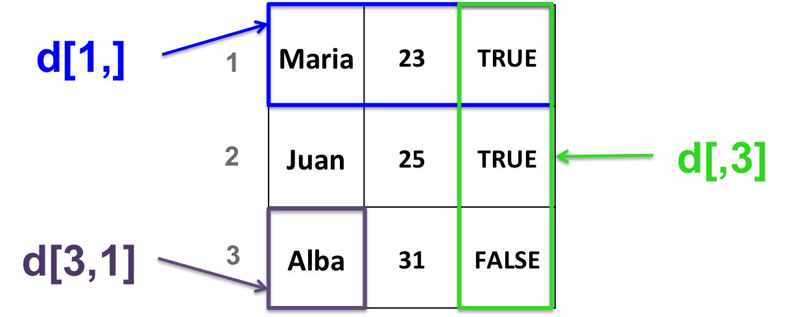

<h2>Data frames</h2>

A data frame is a 2-dimensional structure.
<br> It is more general than a matrix.
<br><br>
All columns in a data frame:
 + can be of different **types** (numeric, character or logical)
 + must have the same **length**

<h3>Create a data frame</h3> 

* With the **data.frame** function:

```{r}
# stringsAsFactors: ensures that characters are treated as characters and not as factors
d <- data.frame(c("Maria", "Juan", "Alba"), 
	c(23, 25, 31),
	c(TRUE, TRUE, FALSE),
	stringsAsFactors = FALSE)
```

* Converting a matrix into a data frame:

```{r}
# create a matrix
b <- matrix(c(1, 0, 34, 44, 12, 4), 
        nrow=3,
        ncol=2)
# convert as data frame
b_df <- as.data.frame(b)
```

<h3>Data frame manipulation:</h3>
<br>
Very similar to matrix manipulation.




> Go to [2-dimension objects manipulation](https://sbcrg.github.io/CRG_RIntroduction/2d_manip)
<br>

> [back to home page](https://sbcrg.github.io/CRG_RIntroduction)

