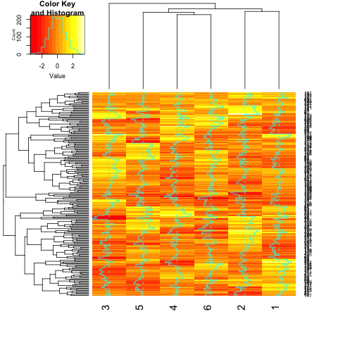
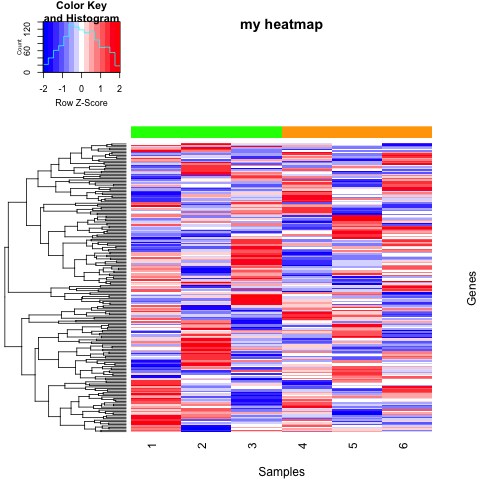
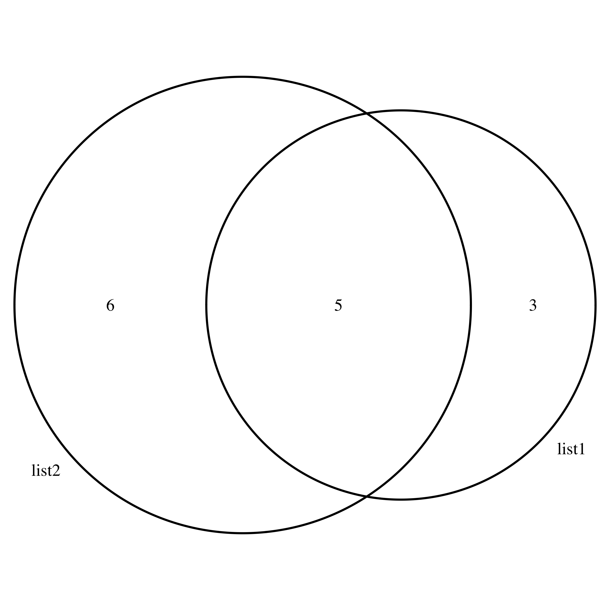
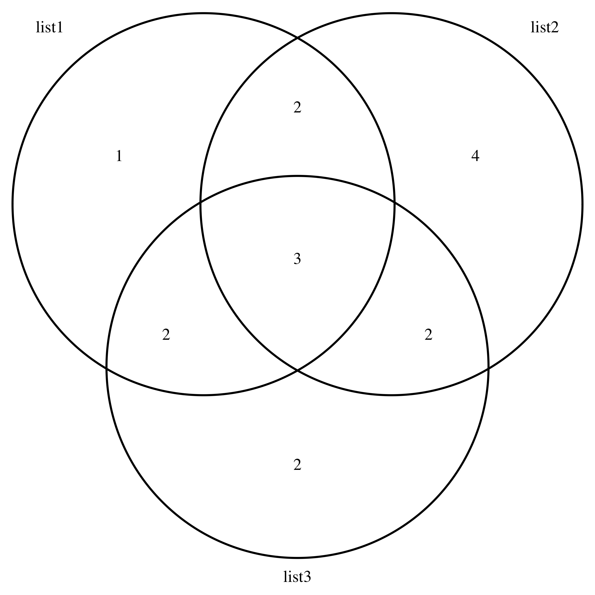

<h2>Plots from other packages</h2>

<h3>heatmap.2 function from gplots package</h3>

The **heatmap.2** function from the **gplots** package is highly customizable.

```{r}
# install and load gplots package
install.packages("gplots")
library("gplots")

# make matrix
mat <- matrix(rnorm(1200), ncol=6)

# heatmap with the defaults parameters
heatmap.2(x=mat)
```


* Useful arguments include:
	* Rowv, Colv : process clustering of columns or rows (default TRUE to both)
	* dendrogram : show dendrogram for row, col, both or none
	* scale : scale data per row, column, or none
	* col : dendrogram color palette
	* trace : control the cyan density lines
	* RowSideColors, ColSideColors :  block of colors that represent the columns or the rows
	* labRow,labCol : remove or keep row or col labels
	* main :  title
	* xlab, ylab: x-axis or y-axis label

```{r}
heatmap.2(x=mat, 
	Colv=FALSE, 
	dendrogram="row",
	scale="row",
	col="bluered",
	trace="none",
	ColSideColors=rep(c("green","orange"), each=3),
	labRow=FALSE,
	main="my heatmap",
	ylab="Genes",
	xlab="Samples")
```




<h3>venn.diagram function from VennDiagram package</h3>

Create up to a 4-way Venn Diagram

```{r}
# load package
library(VennDiagram)

# Prepare character vectors
v1 <- c("DKK1", "NPC1", "NAPG", "ERG", "VHL", "BTD", "MALL", "HAUS1")
v2 <- c("SMAD4", "DKK1", "ASXL3", "ERG", "CKLF", "TIAM1", "VHL", "BTD", "EMP1", "MALL", "PAX3")
v3 <- c("PAX3", "SMAD4", "DKK1", "MALL", "ERG", "CDKN2A", "DENR", "NPC1", "NAPG")

# Create a list of vectors
vlist <- list(v1, v2, v3)
names(vlist) <- c("list1", "list2", "list3")

# 2-way Venn
venn.diagram(vlist[1:2], 
	filename="Venn_2way.png",
	imagetype="png")
```



```{r}
# 3-way Venn
venn.diagram(vlist, 
        filename="Venn_3way.png",
        imagetype="png")
```



* More arguments:
	* main : title
	* sub : sub-title
	* main.col : color of title font
	* fill : color of circles
	* col : color of circle lines
	* cat.col : color of category labels

```{r}
venn.diagram(vlist,     
        filename="Venn_3way_more.png",
        imagetype="png",
	main="Venn diagram",
	sub="3-way",
	main.col="red",
	fill=c("lightgreen", "lightblue", "lightsalmon"),
	col=c("lightgreen", "lightblue", "lightsalmon"),
	cat.col=c("green", "blue", "salmon"))

```


Go to [exercise 11](https://sbcrg.github.io/CRG_RIntroduction/exercise11): base plots.
<br>
> [back to home page](https://sbcrg.github.io/CRG_RIntroduction)

