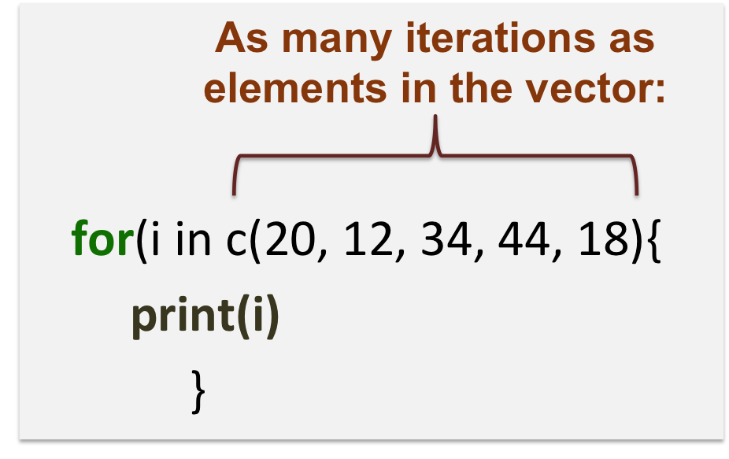
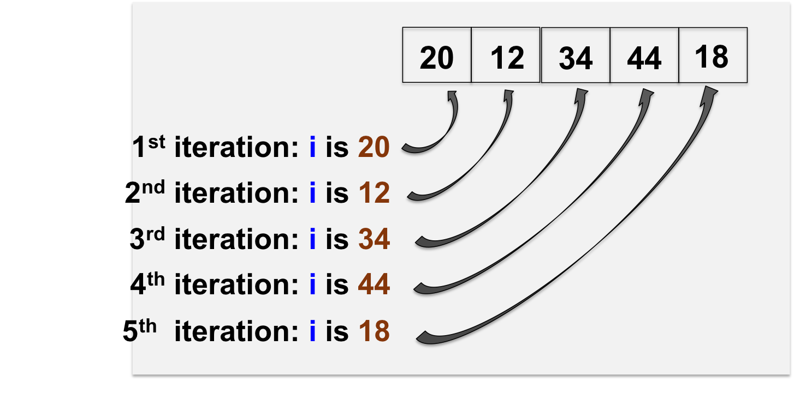

<h2>Repetitive execution</h2>

**Loops** are used to repeat a specific block of code.

<h3>"for" loop</h3>

Example:

```{r}
for(i in 1:10){
    print(i)
}
```

The loop here will execute the chunk of code **n times**, **n** being the length of the vector **1:10**.
<br>
Note the usage of **curly brakets {}** to start and end the loop!






* 
```{r}
for(j in c("apple", "pear", "grape")){
	print(i)
	print(nchar(i))
}
```

Go to [Exercise 8](https://sbcrg.github.io/CRG_RIntroduction/exercise8): Regular expressions.
<br>

> [back to home page](https://sbcrg.github.io/CRG_RIntroduction)
