<h2>ggplot2 package</h2>

* Graphing package inspired by the **G**rammar of **G**raphics work of Leland Wilkinson.

* A tool that enables to concisely describe the components of a graphic.

* Why ggplot2 ?
	+ Flexible
	+ Customizable
	+ Pretty !
	+ Well documented

* All ggplots start with a **base layer** with the **ggplot()** function:

```{r}
ggplot(data=dataframe, aes=(x=column1, y=column2))
```

*The base layer is setting the grounds but NOT plotting anything*

* Add a layer (with the **+** sign) that describes what kind of plot you want:

```{r}
# Example of a scatter plot: add the geom_point() layer
ggplot(data=dataframe, aes(x=column1, y=column2)) + geom_point()
```

* Example of a simple scatter plot:

```{r}
# Create a data frame
df1 <- data.frame(sample1=rnorm(200), sample2=rnorm(200))

# Plot !
ggplot(data= df1 , aes(x=sample1, y=sample2)) + 
	geom_point()
```

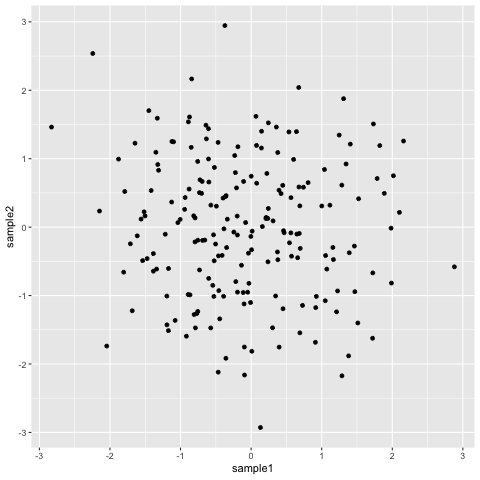


* Add **layers** to that object to customize the plot:
	* **ggtitle** to add a title
	* **geom_vline** to add a vertical line
	* etc.
```{r}
ggplot(data= df1 , aes(x=sample1, y=sample2)) + 
  geom_point() +
	ggtitle("my first ggplot") +
	geom_vline(xintercept=0)
```

Bookmark that [ggplot2 reference](https://ggplot2.tidyverse.org/reference/) and that good [cheatsheet](https://www.rstudio.com/wp-content/uploads/2016/11/ggplot2-cheatsheet-2.1.pdf) for some of the ggplot2 options.

* You can save the plot in an object **at any time** and add layers to that object:

```{r}
# Save in an object
p <- ggplot(data= df1 , aes(x=sample1, y=sample2))
# Add layers to that object
p + ggtitle("my first ggplot")
```

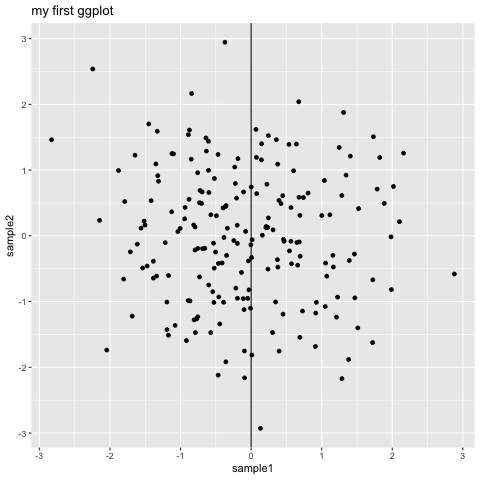

* What is inside the **aes** (aesthetics)function ?
        * **Anything that varies** !
                * Actual columns of to be plotted.
                * Columns with which you want to, for example, color the points.

Color the points according to another column in the data frame:

```{r}
# Build a data frame from df1: add a column with "yes" and "no"
df2 <- data.frame(df1, grouping=rep(c("yes", "no"), c(80, 120)))

# Plot and add the color parameter in the aes():
pscat <- ggplot(data=df2, aes(x=sample1, y=sample2, color=grouping)) + 
  geom_point()
```

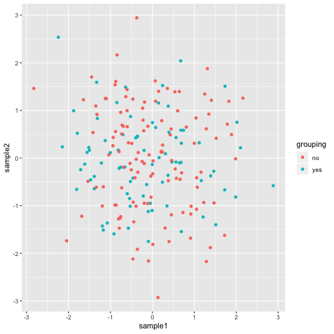

<h3>Box plots</h3>

```{r}
# Simple boxplot
ggplot(data=df2, aes(x=grouping, y=sample1)) + geom_boxplot()
```

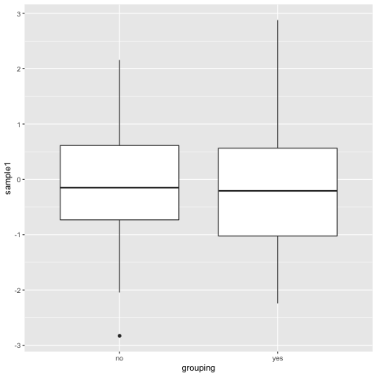

What if you want to plot both sample1 and sample2 ?<br>
*Need to convert into a **long** format*

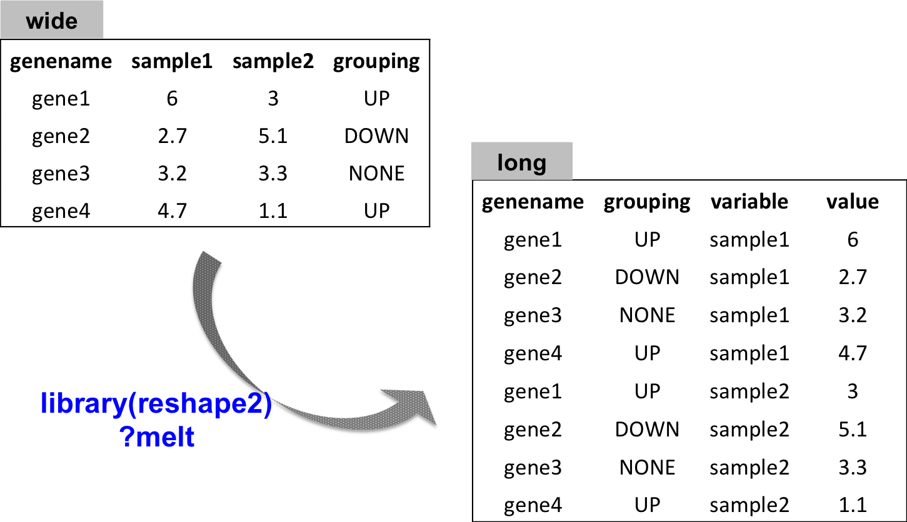

Plotting both sample1 and sample2:

```{r}
# load package reshape2
library(reshape2)

# convert to long format
df_long <- melt(df2)
	# all numeric values are organized into only one column: value
# plot:
ggplot(data=df_long, aes(x=variable, y=value)) + 
  geom_boxplot()
```


What if now you also want to see the distribution of "yes" and "no" in both sample1 and sample2 ?<br>
* Integrate a parameter to the **aes()***

```{r}
# Either color
ggplot(data=df_long, aes(x=variable, y=value, color=grouping)) + 
  geom_boxplot()
```


```{r}
# Or fill
ggplot(data=df_long, aes(x=variable, y=value, fill=grouping)) + 
  geom_boxplot()
```

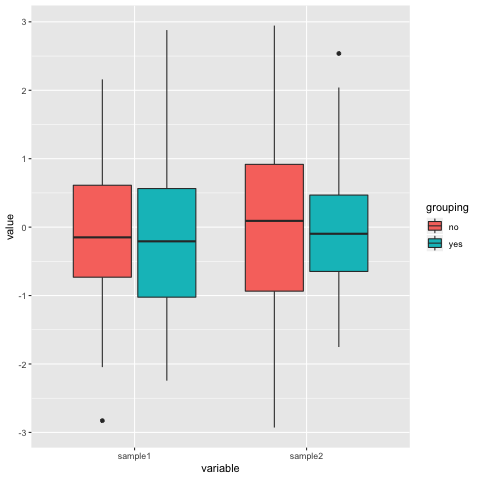

Do you want to change the default colors?<br>
* Integrate either layer:
  * **scale_color_manual()**
  * **scale_fill_manual**

```{r}
pbox <- ggplot(data=df_long, aes(x=variable, y=value, fill=grouping)) + 
	geom_boxplot() +
	scale_fill_manual(values=c("slateblue2", "chocolate"))
```

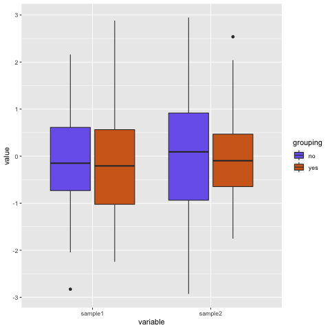


<h3>Bar plots</h3>

```{r}
# A simple bar plot
ggplot(data=df2, aes(x=grouping)) + geom_bar()
```

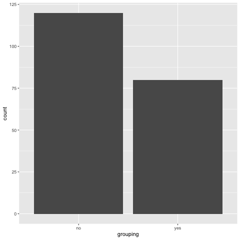

* Customize:
  * **scale_x_discrete** is used to handle x-axis title and labels
  * **coord_flip** swaps the x and y axis
  
```{r}
# Save the plot in the object "p"
pbar <- ggplot(data=df2, aes(x=grouping, fill=grouping)) + 
  geom_bar()

# Change x axis label with scale_x_discrete:
p2 <- p + scale_x_discrete(name="counts of yes / no")

# Swapping x and y axis with coord_flip():
p3 <- p2 + coord_flip()

# Change fill
p4 <- p3 + scale_fill_manual(values=c("yellow", "cyan"))

# Show intermediary and final plots
pbar
p2
p3
p4
```

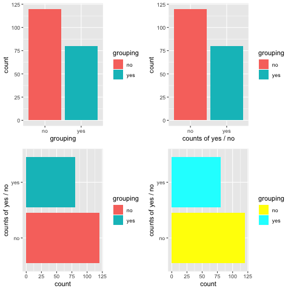


<h3>Histograms</h3>

```{r}
# Simple histogram
ggplot(data=df_long, aes(x=value)) + geom_histogram()

```

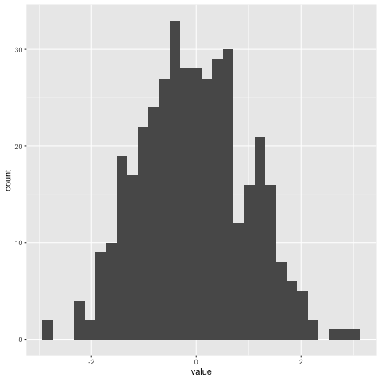

Split by sample ("variable" column)

```{r}
ggplot(df_long, aes(x=value, fill=variable)) + geom_histogram()
```

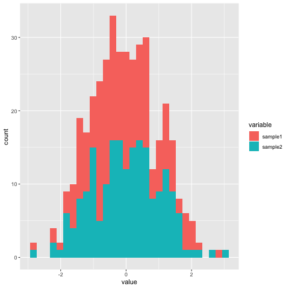

By default, the histograms are **stacked**: change to position **dodge**:

```{r}
phist <- ggplot(df_long, aes(x=value, fill=variable)) + 
	geom_histogram(position='dodge')
```

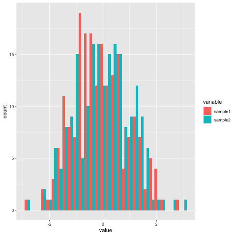

<h3>About themes</h3>

You can change the default **theme** (background color, grid lines etc. all non-data display):

```{r}
# go back to a previous plot
p <- ggplot(data=df_long, aes(x=value)) + geom_histogram()

# Try different themes
p + theme_bw()
p + theme_minimal()
p + theme_void()
p + theme_grey()
p + theme_dark()
p + theme_light() 
```


<h3>Saving plots in files</h3>

* The same as for regular plots applies:

```{r}
png("myggplot.png")
p
dev.off()
```

* You can also used the ggplot2 **ggsave** function:

```{r}
# By default, save the last plot that was produced
ggsave("lastplot.png")

# You can pick which plot you want to save:
ggsave("myplot.png", plot=p)

# Many different formats are available: 
  # "eps", "ps", "tex", "pdf", "jpeg", "tiff", "png", "bmp", "svg", "wmf"
ggsave("myplot.ps", plot=p, device="ps")

# Change the height and width (and their unit):
ggsave("myplot.pdf", 
  width = 20, 
  height = 20, 
  units = "cm")
```

* You can also organize several plots on one page
  * One way is to use the **gridExtra** package:

```{r}
# ncol, nrow: arrange plots in such number of columns and rows
grid.arrange(pscat, pbox, pbar, phist, nrow=2, ncol=2)
grid.arrange(pscat, pbox, pbar, phist, nrow=1, ncol=4)
```

<h3>Volcano plots</h3>

A volcano plot is a type of scatter plot represents differential expression of features (genes for example): on the x-axis we typically find the fold change and on the y-axis the p-value.
<br>

```{r}
# Download the data we will use for plotting
download.file("https://raw.githubusercontent.com/sbcrg/CRG_RIntroduction/master/de_df_for_volcano.rds", "de_df_for_volcano.rds", method="curl")

# The RDS format is used to save a single R object to a file, and to restore it.
# Extract that object in the current session:
tmp <- readRDS("de_df_for_volcano.rds")

# remove rows that contain NA values
de <- tmp[complete.cases(tmp), ]
``` 

```{r}
# The basic scatter plot: x is "log2FoldChange", y is "pvalue"
ggplot(data=de, aes(x=log2FoldChange, y=pvalue)) + geom_point()
```


Doesn't look quite like a Volcano plot...<br>
Convert the p-value into a -log10(p-value)

```{r}
# Convert directly in the aes()
p <- ggplot(data=de, aes(x=log2FoldChange, y=-log10(pvalue))) + geom_point()
```


```{r}
# Add more simple "theme"
p <- ggplot(data=de, aes(x=log2FoldChange, y=-log10(pvalue))) + geom_point() + theme_minimal()
```

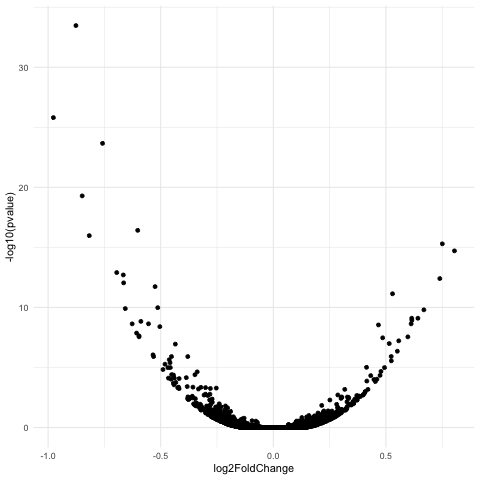

```{r}
# Add vertical lines for log2FoldChange thresholds, and one horizontal line for the p-value threshold 
p2 <- p + geom_vline(xintercept=c(-0.6, 0.6), col="red") +
	geom_hline(yintercept=-log10(0.05), col="red")
```

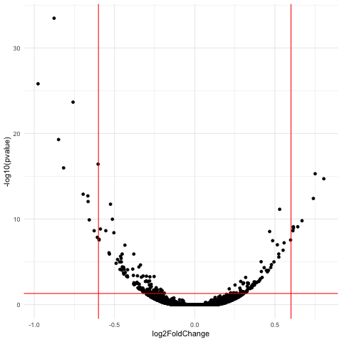

```{r}
# The significantly differentially expressed genes are the ones found in the upper-left and upper-right corners.
# Add a column to the data frame to specify if they are UP- or DOWN- regulated (log2FoldChange respectively positive or negative)

# add a column of NAs
de$diffexpressed <- "NO"
# if log2Foldchange > 0.6 and pvalue < 0.05, set as "UP" 
de$diffexpressed[de$log2FoldChange > 0.6 & de$pvalue < 0.05] <- "UP"
# if log2Foldchange < -0.6 and pvalue < 0.05, set as "DOWN"
de$diffexpressed[de$log2FoldChange < -0.6 & de$pvalue < 0.05] <- "DOWN"

# Re-plot but this time color the points with "diffexpressed"
p <- ggplot(data=de, aes(x=log2FoldChange, y=-log10(pvalue), col=diffexpressed)) + geom_point() + theme_minimal()

# Add lines as before...
p2 <- p + geom_vline(xintercept=c(-0.6, 0.6), col="red") +
        geom_hline(yintercept=-log10(0.05), col="red")
```

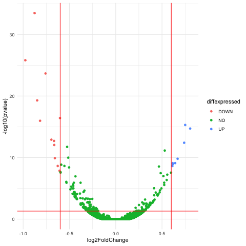

```{r}
# Change point color:
p3 <- p2 + scale_color_manual(values=c("blue", "black", "red"))
```


```{r}
# Now write down the name of genes beside the points...
# Create a new column "delabel" to de, that will contain the name of genes differentially expressed (NA in case they are not)
de$delabel <- NA
de$delabel[de$diffexpressed != "NO"] <- de$gene_symbol[de$diffexpressed != "NO"]

ggplot(data=de, aes(x=log2FoldChange, y=-log10(pvalue), col=diffexpressed, label=delabel)) + 
	geom_point() + 
	theme_minimal() +
	geom_text()
```


```{r}
# Finally, we can organize the labels nicely using the "ggrepel" package and the geom_text_repel() function
# load library
library(ggrepel)
# plot adding up all layers we have seen so far
ggplot(data=de, aes(x=log2FoldChange, y=-log10(pvalue), col=diffexpressed, label=delabel)) +
        geom_point() + 
        theme_minimal() +
        geom_text_repel() +
        scale_color_manual(values=c("blue", "black", "red")) +
        geom_vline(xintercept=c(-0.6, 0.6), col="red") +
        geom_hline(yintercept=-log10(0.05), col="red")
```

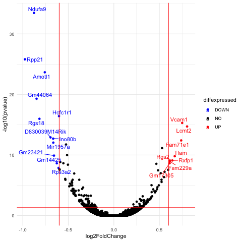


> [back to home page](https://sbcrg.github.io/CRG_RIntroduction)

