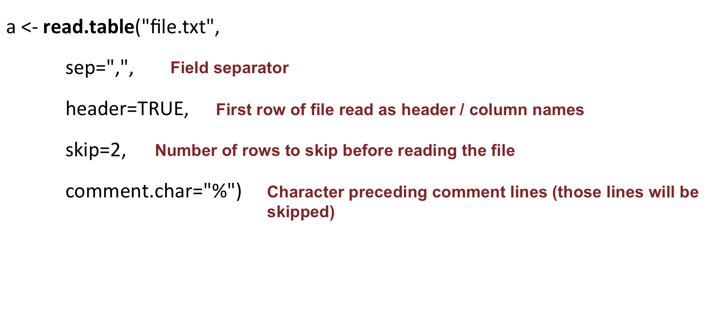

<h2>Input / Output<h2>

We will learn how to:
	+ Read in a file
	+ Write out a file
	+ Save a graph in a file (Module 3)

<h3>On vectors</h3>

* Read a file into a vector with the **scan** function

```{r}
scan("file.txt")
```

By default, scans "double" (numeric) elements: it fails if the input contains characters. Specify the type of data contained in the file: 

```{r}
# specify the type of data to scan
scan("file.txt", what="character")
# you can provide the full path; if the file is located, for example, in the home directory:
scan("~/file.txt", )
``` 

* Write the content of a vector in a file:

```{r}
# create a vector
mygenes <- c("SMAD4", "DKK1", "ASXL3", "ERG", "CKLF", "TIAM1", "VHL", "BTD", "EMP1", "MALL", "PAX3")
# write in a file
write(mygenes, file="gene_list.txt")
```

<h3>On data frame</h3>

* Read a file into a data frame with the **read.table** function:

```{r}
a <- read.table("file.txt")
```

Useful arguments:

<a href="https://sbcrg.github.io/CRG_RIntroduction/images/readtable.png"></a>

> Go to [Exercise 6]((https://sbcrg.github.io/CRG_RIntroduction/exercise6)
<br>
> [back to home page](https://sbcrg.github.io/CRG_RIntroduction)

