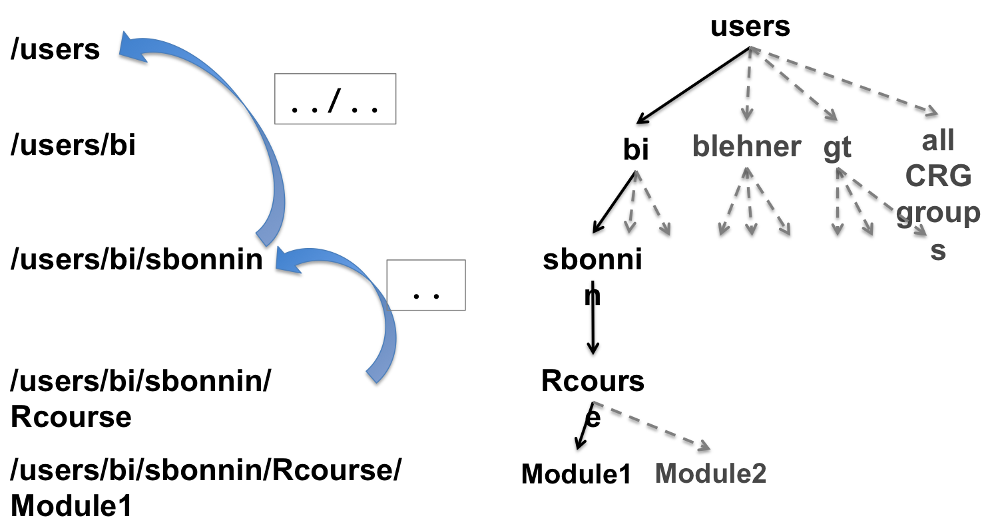

<h2>Paths and directories</h2>

* The path of a file/directory is its location/address in the file system.

* Your home directory is the one that hosts your personal folder:
+ for CRG users: /nfs/users/[yourgroup]/[yourlogin]

* The shortcut to your home directoryis <b>~</b>

<h2>Tree of directories</h2>


<h2>Navigate with R terminal</h2>

* Path of the current directory (know where you are working at the moment):
<b>getwd</b>: get working directory
```{r}	
getwd()
```

* Change working directory
Go to a directory giving the absolute path: 
```{r}
setwd("/nfs/users/bi/sbonnin/Rcourse")
```
Go to a directory giving the relative path:
```{r}
setwd("Module1")
```
You are now in: "/nfs/users/bi/sbonnin/Rcourse/Module1"
<br>
Move one directory "up" the tree with:
```{r} 
setwd("..")
```
You are now in: "/nfs/users/bi/sbonnin/Rcourse"

