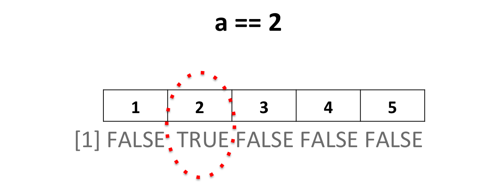
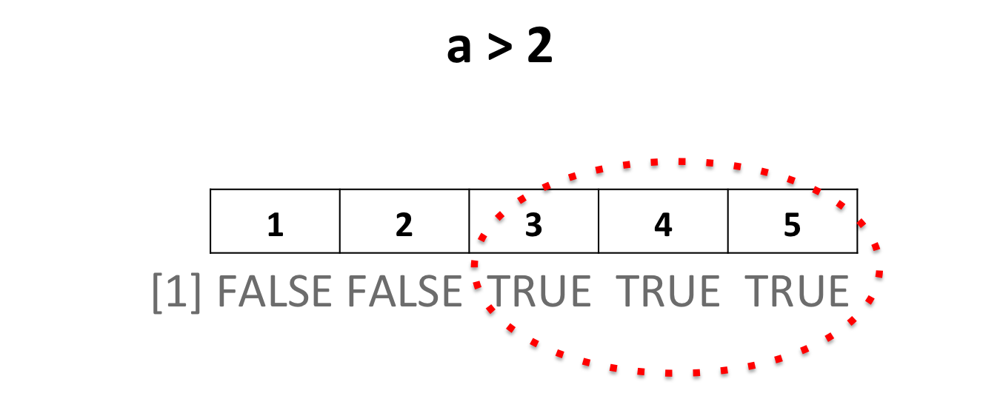

<h2>Vectors</h2>

A vector is a sequence of data elements from the **same type**.

| 329 | 45 | 12 | 28 |


<h3>Creating a vector</h3>

* Values are assigned to a vector using the **c** command (**c**ombining elements).

```{r}
a <- c(329, 45, 12, 28)
```

* Create a sequence of consecutive numbers:

```{r}
a <- 1:6
# same as:
a <- c(1, 2, 3, 4, 5, 6)
# both ends (1 and 6) are included
```

* Character vectors

 + Each element is between (single or double) quotes.

| mRNA | miRNA | snoRNA | lncRNA |

```{r}
b <- c("mRNA", "miRNA", "snoRNA", "lncRNA")
```

<h3>Vector manipulation</h3>

* A vector can be named: each element of the vector can be assigned a name (number or character)

```{r}
names(a) <- c("mRNA", "miRNA", "snoRNA", "lncRNA")
# use an object which already contains a vector
names(a) <- b
```

* Get the length (number of elements) of a vector

```{r}
length(a)
```

* Extracting elements from vector **a**

 + extract elements using their position (index) in the vector:


```{r}
a <- 1:6
a[1]
a[c(1,3)]
a[2:4]
```

 + extract elements using their names:


```{r}
a["mRNA"]
a[c("miRNA", "lncRNA")]            
```

* Replacing a vector's value

```{r}
a[2] <- 31
a["miRNA"] <- 31
```

* Removing a vector's element

```{r}
a <- a[-3]
```

* __Show__ versus __change__

x[-2]  x <span style="color:red">unchanged</span> !

x <- x[-2]  x <span style="color:red">reassigned</span> !

<h3>Numeric vector manipulation</h3>

<h4>Logical operators</h4>

| Operator  | Function      |
|:--------: |:-------------:|
|     <     | less than      |
|     <=    | less than or equal to   |
|     >     | greater than  |
|     >=    | greater than or equal to|
|     ==    | exactly equal to   |
|     !=    | not equal to |


* Which elements of **a** are equal to 2?
```{r}
a <- 1:5
a == 2
```


* Which elements of **a** are superior to 2?
```{r}
a <- 1:5
a > 2
```


* Extract elements of a vector that comply with the condition
```{r}
a <- 1:5
a >= 2
a[a >= 2]
```


<h4>Operations on vectors</h4>

* Adding 2 to a vector adds 2 to **each element** of the vector

```{r}
a <- 1:5
a + 2
```


> Same goes for subtractions, multiplications and divisions...

* Multiplying a vector by another vector of equal length

```{r}
a <- c(2, 4, 6)
b <- c(2, 3, 0)
a * b
```


* Multiplying a vector by another **shorter** vector

```{r}
a <- c(2, 4, 6, 3, 1)
b <- c(2, 3, 0)
a * b
```


> Vector **a** is "recycled" !


<br>


> [back to home page](https://sbcrg.github.io/CRG_RIntroduction)

